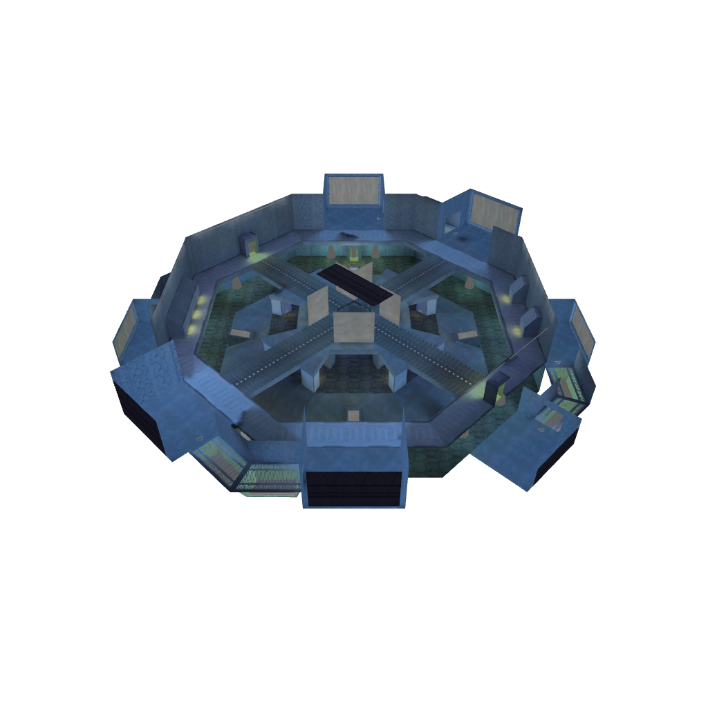
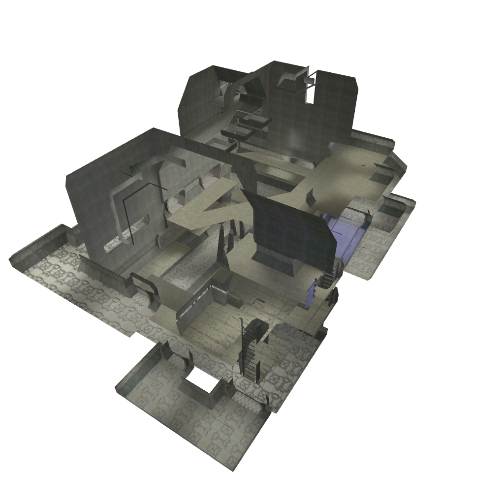

# vkblam [](https://raw.githubusercontent.com/Wunkolo/vkblam/main/LICENSE) 

**vkblam** is a re-implementation of the Halo 1 blam engine's graphics library in vulkan.

Currently this is highly experimental and only generates static images and not a real-time interactable window.

Derelict|Prisoner
-|-
 | 

## Building

vkblam requires the official Vulkan SDK library and tools to be installed:

|||
|-|-|
Windows|[LunarG VulkanSDK](https://vulkan.lunarg.com/sdk/home#windows)
Mac|[LunarG VulkanSDK](https://vulkan.lunarg.com/sdk/home#mac)
Arch|[vulkan-devel](https://archlinux.org/groups/x86_64/vulkan-devel/)
Ubuntu|`libvulkan-dev spirv-tools vulkan-tools`

Once all dependencies are satisfied
[a typical cmake out-of-source build may be done](https://preshing.com/20170511/how-to-build-a-cmake-based-project/#running-cmake-from-the-command-line).

```
git clone --recursive https://github.com/Wunkolo/vkblam
mkdir build
cd build
cmake ..
cmake --build .
```

## Acknowledgements

* [Reclaimers](https://c20.reclaimers.net/)
* [Assembly](https://github.com/XboxChaos/Assembly)
* [Sparkedit](https://github.com/HaloMods/SparkEdit)
* [Swordedit](https://github.com/ChadSki/Swordedit)
* [Prometheus](https://github.com/HaloMods/Prometheus)
